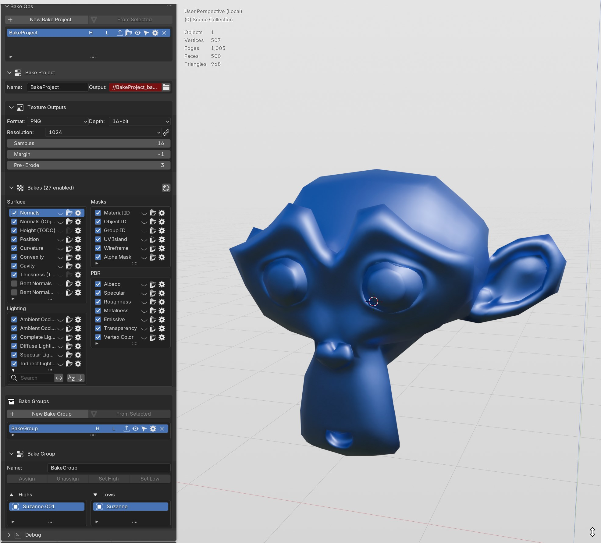

# LKS Baker



Standalone texture baking toolkit for Blender 4.2+. Organize high-to-low poly baking into structured **Bake Projects** with per-map-type control, GPU-accelerated image filters, and a deep test pyramid.

## Installation

### Install as a Blender Extension (recommended)

1. Open Blender → Edit → Preferences → Get Extensions
2. Click the arrow next to **Repositories** → **Add Repository**
3. Enter:
   - **Name:** LKS Baker
   - **URL:** `https://liamsmyth.github.io/LKS_Baker/`
4. Click **Add Repository**
5. Search for "LKS Baker" → click **Install**

Blender will handle updates automatically whenever a new release is published.

### Manual Install (folder)

1. Copy the `lks_baker` folder into Blender's `scripts/addons/` directory
2. Enable **LKS Baker** in Edit → Preferences → Add-ons

The panel appears in the 3D View sidebar (N key) under the **LKS Baker** tab.

## Requirements

- Blender 4.2.0 or later
- Python packages: `numpy`, `scipy`, `Pillow` (install into Blender's Python via `pip install --target <blender>/python/Lib/site-packages scipy pillow`)

## Features

- **Project-based workflow** — group source/target meshes into Bake Projects and Bake Groups, with clear high/low role assignments
- **Multi-map baking** — bake normals, AO, curvature, bent normals, specular, emissive, roughness, metalness, and more via Blender Cycles
- **GPU image filters** — GPU-accelerated post-processing: blur, dilate, normalize, remap coordinate systems, flip channels
- **Bent normal & AO maps** — dedicated CPU and GPU implementations including HBAO variants, normal cavity, and hemisphere trace
- **Curvature maps** — multi-method soft curvature with CPU/GPU parity testing
- **Texture derivatives** — automatic generation of derived maps (e.g., AO from curvature, roughness from specular)
- **Margin & resolution control** — per-project texture resolution, padding, antialiasing, and dilation settings
- **Export pipeline** — export individual bake groups or full projects with consistent naming conventions
- **Headless testing** — comprehensive test suite runnable in `--background` mode for CI/CD integration
- **Hot-reload support** — disable/re-enable the addon to reload all code without restarting Blender

## Quick Start

1. In the 3D View sidebar → **LKS Baker** tab, click **New Bake Project**
2. Select your high-poly and low-poly objects, click **Add to Bake Group**
3. Assign each object to its **High** or **Low** role
4. Select which map types to bake (AO, Normal, Curvature, etc.)
5. Click **Bake Project** to run Cycles baking

## Testing

Run the headless test suite:

```powershell
blender.exe --background --factory-startup --python-exit-code 1 --python tests\test_basic.py
```

## Project Structure

```
lks_baker/
├── bake_ops/          # Core baking operators, engine, map types, and tests
├── shared_utilities/  # Shared helpers (mesh, UV, collection, reload)
├── ops/               # Placeholder for future additional operators
├── util/              # Placeholder for future utilities
├── dev/               # Local-only mock data and test operators (excluded from builds)
├── tests/             # Headless test suite
├── register_addon.py  # Central registration orchestrator
└── __init__.py        # Deep-reload entry point
```

## Publishing

Uses the shared `addon_tools` pipeline:
- `push_remote.bat` — push filtered code to GitHub (excludes dev files via `.remoteignore`)
- `release.bat` — bump version, push code, build extension zip
- `test_sandbox_extension.bat` — verify extension zip integrity
